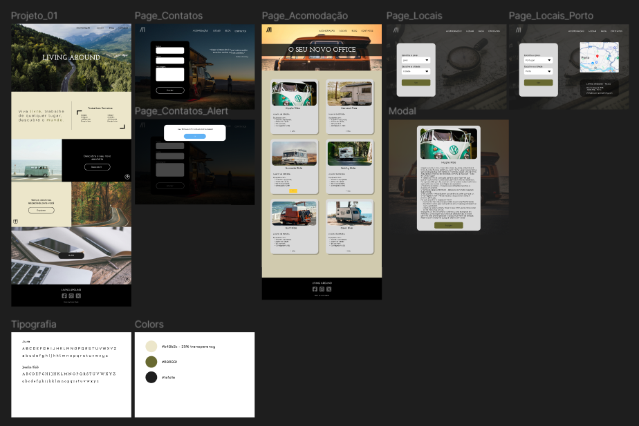
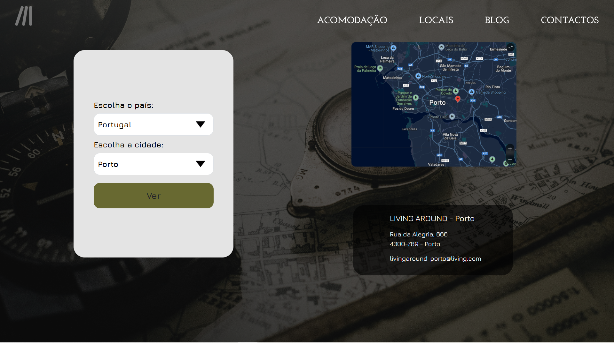
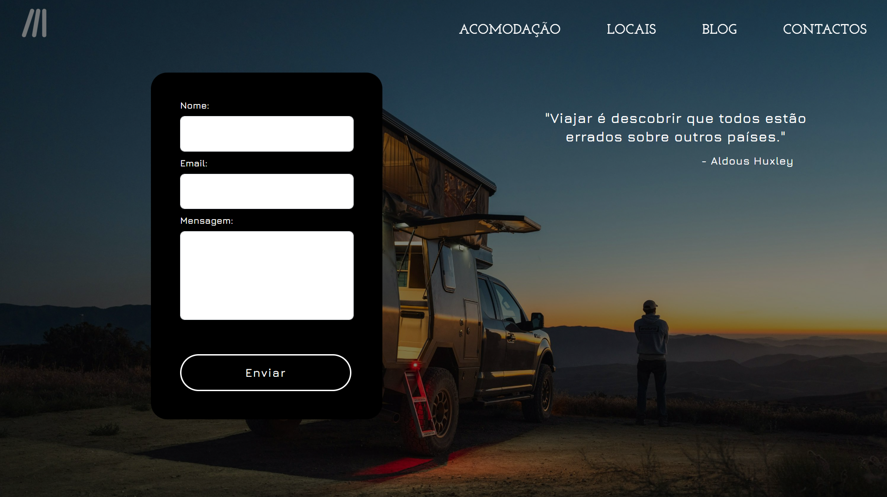

# LIVING AROUND PROJECT

## Project Overview

**Living Around** is a visually appealing, responsive website built to showcase a lifestyle of freedom. With locations, accommodations, and contact options, it's completely designed with the user experience in mind. This project demonstrates strong front-end skills and responsive design techniques.

It is structured to provide a seamless experience across all platforms, incorporating an intuitive navigation system.

## Project Features

- **Responsive Layout**
- **Interactive Forms**
- **Modal Windows**
- **Modern Styling**

## Technologies Used

- **HTML5**
- **CSS3**
- **JavaScript(ES6)**
- **Bootstrap5**

## Project Showcase

### Project Goal: To Replicate & Build a Responsive Website from this Figma Layout

### Page 1:

### Page 2:

### Page 3:

### Page 4:

## Project Author

- joaodias23
- https://github.com/joaodias23